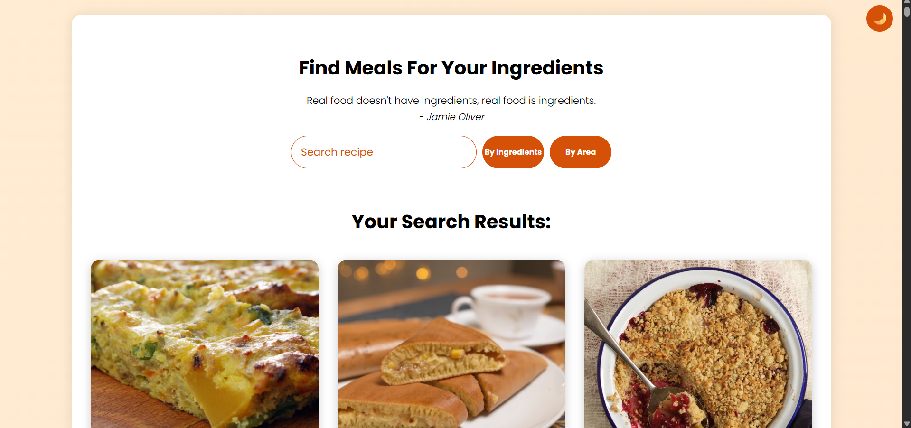
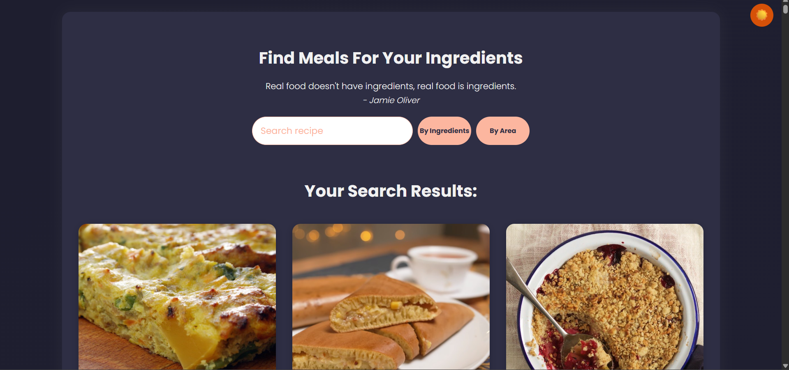
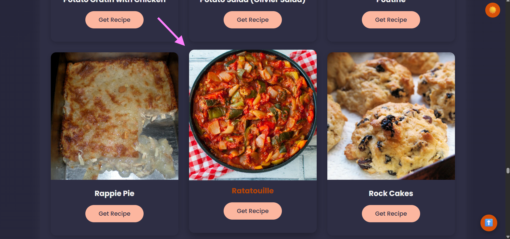
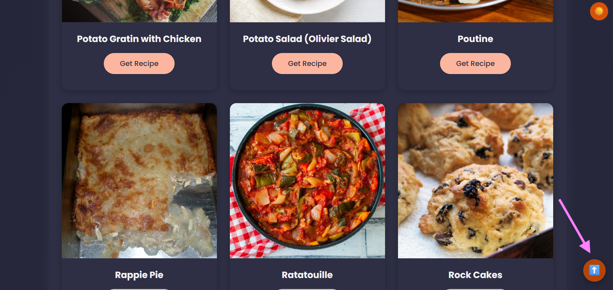

# 🥗 Recipe Recommendation – ROSPL Mini Project

> A web application that allows users to search for meals using ingredients or cuisines.
> It uses TheMealDB API to fetch real-time recipe data with instructions and video links.

This project was enhanced as part of the ROSPL Mini Project (Semester VI).

---

## ✨ Features

-   🔍 **Search Recipes by Ingredient** (e.g., “chicken”, “egg”)
-   🌍 **Search Recipes by Country/Area** (e.g., “Indian”, “Mexican”)
-   📜 **Detailed Recipe View** – instructions, category, and video link
-   🌈 **Gradient Background** – modern and minimal
-   🌙 **Dark/Light Mode Toggle** – switches theme dynamically
-   ✨ **Animated Buttons** – smooth hover transitions for better UX
-   🆙 **Back to Top Button** – for easy navigation
-   🧹 **Clear Search Feature** – quickly reset input and results
-   ⌨️ **Smart Enter Key Search** – detects whether user entered ingredient or cuisine
-   ⚡ **Modern Async/Await Logic** – cleaner and faster API fetching
-   🧱 **Error Handling Added** – shows friendly message on network errors

---

## 🧠 Technologies Used

| Area            | Technology                                |
| --------------- | ----------------------------------------- |
| **Frontend** | HTML5, CSS3, JavaScript (ES6)             |
| **API** | TheMealDB API                             |
| **Version Control** | Git, GitHub                             |
| **Design** | Responsive Web Design, Accessibility      |

---

## 👨‍💻 Group Members

| Name                  | Role            | Contribution                                                                                              |
| --------------------- | --------------- | --------------------------------------------------------------------------------------------------------- |
| **Manmit Singh Chouhan** | Lead Developer | Major updates: Implemented Dark/Light Mode, Clear Search feature, and intelligent Enter-key search. Refactored JavaScript using async/await for modern structure and better error handling. Improved accessibility and layout. |
| **Girase Hitesh** | UI & Animation | Designed modern gradient theme and button hover animations. Enhanced overall color palette consistency and user interface appeal.|
| **Aniket Mali** | Design & UI Testing| Enhanced recipe cards with hover/zoom effects and optimized responsive behavior using Flexbox.|
| **Doiphode Sakshi**| Navigation  | Implemented Back-to-Top feature and tested navigation responsiveness across devices. |

---

## 🧾 Setup & Run Instructions

### 1. Clone the Repository

git clone [https://github.com/manmitsinghchouhan/Recipe-Recommendation.git](https://github.com/manmitsinghchouhan/Recipe-Recommendation.git)
cd Recipe-Recommendation 

### 2. Open the Project
Just open `index.html` in your browser.
> **Note:** No backend is required – it uses TheMealDB’s public API.

---

## 🚀 Try It Out

1.  Enter an ingredient (e.g., “chicken”) or an area (e.g., “Indian”).
2.  Press `Enter` or click the corresponding button.
3.  View the search results and click on any recipe for detailed instructions.

---

## ⚖️ License

This project is licensed under the MIT License.

**Copyright © 2023 Sudeep Poojary**

*Modified in 2025 by Manmit Singh Chouhan & Team for educational use under ROSPL.*

---

### 🪄 Screenshots

| Light Mode | Dark Mode |
| :---: | :---: |
|  |  |

| Card Hover Effect | Back to Top Button |
| :---: | :---: |
|  |  |
